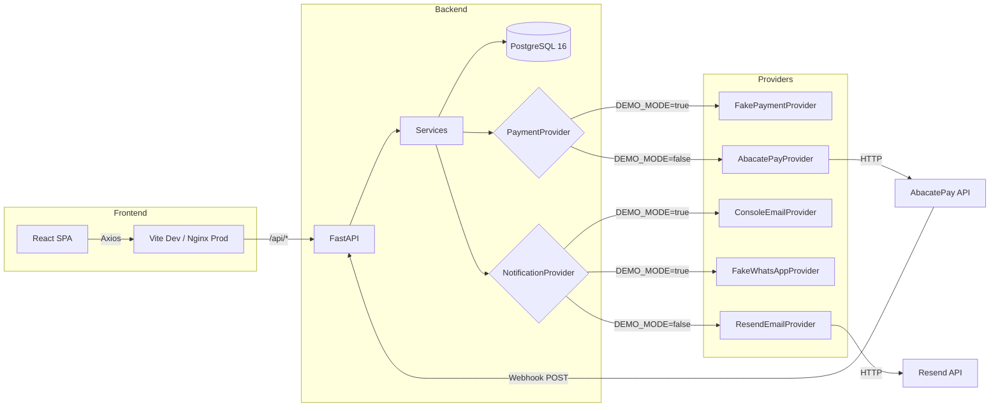

# Arquitetura — Doce Encanto

## Diagrama geral

## Decisões de arquitetura

### 1. Providers plugáveis via ABC + Factory

Todo o código de negócio depende de `PaymentProvider` e `NotificationProvider`
(classes abstratas em `app/services/payment/base.py` e `app/services/notification/base.py`).

A escolha concreta acontece em **um único ponto**: `app/core/deps.py`, controlada
por `DEMO_MODE`. Adicionar um novo gateway (Stripe, MercadoPago) é:
1. Criar o arquivo implementando a ABC.
2. Registrar um branch na factory.
3. Nenhum outro arquivo precisa mudar.

### 2. Preços em centavos (int)

Evita floating-point drift. O frontend formata com `Intl.NumberFormat('pt-BR', ...)`.
O banco armazena `INTEGER` em todas as colunas monetárias.

### 3. Slot capacity com row lock

Slots de agendamento têm capacidade limitada (default 5 pedidos por slot).
O `reserve_slot()` usa `SELECT ... FOR UPDATE` dentro da mesma transação
do `INSERT INTO orders`, garantindo que dois requests simultâneos não
reservem a mesma vaga.

### 4. Webhook idempotente

`payment_events.external_event_id` é `UNIQUE`. Se a AbacatePay reenviar o
mesmo evento, a tentativa de INSERT dá `IntegrityError` e retornamos 200
sem processar de novo.

### 5. Notificações persistidas ANTES do envio

A row em `notifications` é criada com `status=queued` antes de chamar o
provider. Se o provider falhar, o status fica `failed` mas o registro existe
— a Caixa de Saída do admin mostra tudo.

### 6. DEMO_MODE fail-fast

Se `DEMO_MODE=false` e faltam credenciais obrigatórias, a aplicação **crasheia
no startup** com mensagem explícita. Nunca cai silenciosamente no fake.

---

## Mapa de rotas da API

| Método | Rota | Auth | Descrição |
|--------|------|------|-----------|
| GET | /api/products | — | Lista produtos ativos |
| GET | /api/products/:slug | — | Produto por slug |
| GET | /api/scheduling/availability | — | Slots disponíveis para data/tipo |
| POST | /api/orders | — | Criar pedido |
| GET | /api/orders/:id | — | Pedido por ID |
| POST | /api/orders/:id/pay | — | Gerar cobrança Pix |
| GET | /api/orders/:id/payment-status | — | Status do pagamento |
| POST | /api/orders/:id/simulate-payment | — | (DEMO_MODE only) Aprovar |
| POST | /api/webhooks/abacatepay | — | Webhook da AbacatePay |
| GET | /api/tracking/:token | — | Rastreio público |
| POST | /api/admin/login | — | Login admin |
| GET | /api/admin/dashboard | JWT | Cards do dashboard |
| GET | /api/admin/orders | JWT | Listar pedidos |
| PATCH | /api/admin/orders/:id/status | JWT | Mudar status |
| GET | /api/admin/products | JWT | Listar todos os produtos |
| POST | /api/admin/products | JWT | Criar produto |
| PATCH | /api/admin/products/:id | JWT | Editar produto |
| GET | /api/admin/notifications | JWT | Caixa de saída |

---

## Extensões futuras (documentadas, não implementadas)

- **WhatsApp real (Meta Cloud API)**: implementar `MetaWhatsAppProvider` no slot de `NotificationProvider`.
- **Cartão de crédito real**: AbacatePay suporta cartão; criar um `CardCharge` flow parallel ao Pix.
- **Multi-tenant**: adicionar `store_id` ao schema para suportar múltiplas lojas.
- **Cron de lembretes**: o template `scheduling_reminder` é registrado mas não disparado automaticamente; adicionar Celery beat ou APScheduler.
